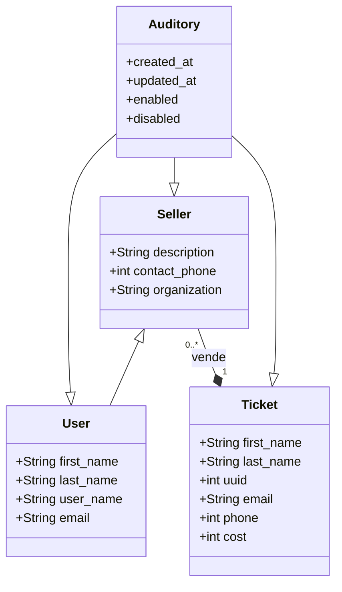

```mermaid
classDiagram
    Auditory --|> User
    Auditory --|>Seller
    Seller <|-- User
    Auditory --|> Ticket
     Seller "0..*" --* "1" Ticket : vende
    class Auditory{
        +created_at
        +updated_at
        +enabled
        +disabled
    }
    class User{
      +String first_name
      +String last_name
      +String user_name
      +String email
    }
    class Seller{
      +String description
      +int contact_phone
      +String organization
    }
    class Ticket{
      +String first_name
      +String last_name
      +int uuid
      +String email
      +int phone
      +int cost
    }
```
